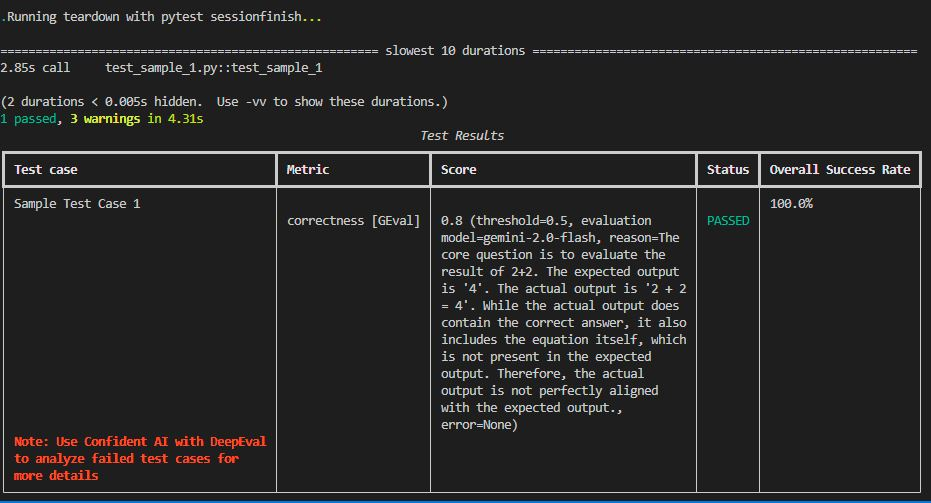

# poc-deep-eval — DeepEval proof-of-concept

This repository is a small proof-of-concept for exploring the DeepEval evaluation framework with a Google Gemini-based evaluator and a simple RAG (retrieval-augmented generation) pipeline.

The code in `src/eval_pipeline` demonstrates how to create LLM test cases, define metrics (GEval wrapper and a custom metric), and run evaluations. The `src/rag_pipeline` code shows a minimal RAG pipeline using SentenceTransformers + Chroma.

## Project structure

- `requirements.txt` — Python dependencies for the project.
- `src/eval_pipeline/`
  - `test_sample_1.py` — Minimal end-to-end sample showing how to call a Gemini model, build an `LLMTestCase`, attach a `GEval` correctness metric and assert the test.
  - `test_app.py` — Another example showing `evaluate()` with correctness and semantic-similarity GEval metrics.
  - `correctness.py` — Example custom metric implementation (`GeminiCorrectnessMetric`) that uses the Gemini model (via `litellm.completion`) to score correctness between expected and actual outputs.
- `src/rag_pipeline/` — Minimal RAG pipeline using `SentenceTransformer` for embeddings and `chromadb` for vector storage. Useful for retrieval experiments.

## What this repo demonstrates

- How to build a small evaluation test harness for LLM outputs using DeepEval concepts (test cases, metrics, assertion/evaluation helpers).
- How to use a Gemini LLM wrapper (`GeminiModel`) to generate outputs and to drive evaluation metrics.
- A simple RAG pipeline pattern for embedding and retrieving documents.

## Important files to read first

- `src/eval_pipeline/test_sample_1.py` — Good starting point. It:
  - Loads `GOOGLE_API_KEY` from environment (via `.env`).
  - Instantiates `GeminiModel`.
  - Calls `gemini.generate(...)` to get actual output for a simple question.
  - Builds `LLMTestCase` with input, expected output, and actual output.
  - Uses a `GEval` metric configured with the Gemini model to evaluate correctness and calls `assert_test()`.

## Quick start

1. Create and activate a Python 3.11+ virtual environment.

   Windows PowerShell example:

```powershell
python -m venv .venv; .\.venv\Scripts\Activate.ps1
```

2. Install dependencies:

```powershell
python -m pip install -r requirements.txt
```

3. Create a `.env` file in the repository root with your Google API key:

```
GOOGLE_API_KEY=your_google_api_key_here
```

4. Run the sample test directly (this will call Gemini and may incur API usage/costs):

```powershell
python src\eval_pipeline\test_sample_1.py
```

Notes:
- `test_sample_1.py` uses `gemini.generate(...)` and then builds an `LLMTestCase` and calls `assert_test()`. The code expects `generate()` to return an iterable (the script uses `actual_output[0].strip()`). If your Gemini wrapper returns a string, adjust accordingly.
- Ensure your environment variable `GOOGLE_API_KEY` is set and valid.

## test_sample_1.py explained

- Purpose: a minimal
example showing correctness evaluation for a trivial question.

Key steps inside the test:

- Load env and initialize a Gemini LLM wrapper (`GeminiModel`) with `GOOGLE_API_KEY`.
- Create a `GEval` metric configured to evaluate correctness. `GEval` is a convenience wrapper that uses an LLM (Gemini) to compare actual vs expected outputs according to a human-readable criteria string.
- Generate an actual output by calling `gemini.generate(question)`.
- Construct an `LLMTestCase` with `input`, `expected_output` and `actual_output` along with attached metrics.
- Call `assert_test(test_case, [metric])` — this should raise/assert if the metric fails the threshold.

## How metrics work (short)

- `GEval` delegates evaluation to an LLM (Gemini here) using the `evaluation_params` listed. The metric is expected to return a numeric score between 0 and 1. A threshold on the metric controls pass/fail.
- `correctness.py` contains `GeminiCorrectnessMetric` as an example of a custom metric that crafts a completion prompt to have Gemini return a numeric score.

## RAG pipeline notes

- `src/rag_pipeline/rag.py` shows how to embed text using `SentenceTransformer` and store/query with `chromadb`. It's a standalone utility used to simulate retrieval for context-building in evaluation scenarios. Add documents via `RAGPipeline.add_document(...)` and query via `query(...)`.

## Known caveats & suggestions

- The code assumes the `GeminiModel` wrapper and `deepeval` package are available in the PYTHONPATH. If you installed `deepeval` from PyPI or have it in a different location, adjust imports or PYTHONPATH accordingly.
- The sample `correctness.py` extracts a float directly from the model output. In practice you should add robust parsing and fallback behavior in case the LLM responds with text instead of a bare numeric score.
- Running the sample scripts will call external APIs and may incur cost. Use a small number of tests while exploring.

## Next steps (ideas)

- Add a small driver script that runs multiple test cases and writes a CSV of metric scores.
- Wrap metric calls with retries and robust parsing (e.g., regex to find numeric score, default to 0 on parse failure).
- Add unit tests for the metric parsing logic and for `RAGPipeline` adding/querying.

## License

This repo is a personal proof-of-concept. No license file included.

---

If you'd like, I can:
- add a small runner script that executes a list of sample tests and prints summarized scores, or
- add robust parsing/validation for the metric outputs and include unit tests.

Tell me which follow-up you'd like and I'll implement it.

## Sample test run

Below is a sample test run result captured from running `test_sample_1.py` with the Gemini evaluation metrics. This is the output displayed by the test harness (trimmed for readability):

- Test run: `test_sample_1.py::test_sample_1`
- Duration: ~2.85s for the test call
- Summary: 1 passed, 3 warnings

Test Results (human-readable extract):

- Test case: Sample Test Case 1
- Metric: correctness [GEval]
- Score & details:
  - score: 0.8 (threshold=0.5)
  - evaluation model: gemini-2.0-flash
  - reason: The core question is to evaluate the result of 2+2. The expected output is '4'. The actual output is '2 + 2 = 4'. While the actual output does contain the correct answer, it also includes the equation itself, which is not present in the expected output. Therefore, the actual output is not perfectly aligned with the expected output.
  - error: None
- Status: PASSED
- Overall Success Rate: 100.0%

Note: The harness prints a small red note: "Use Confident AI with DeepEval to analyze failed test cases for more details" if you want deeper failure analysis.

This example demonstrates that the GEval metric returned a numeric score (0.8) above the threshold (0.5), so the test passed. The detailed reason text is generated by the evaluation LLM and helps explain why the score was given.

### Screenshot

If you have a screenshot of the test run (like the one shown in the project attachments), place it at `assets/test_run.png` and it will be displayed here automatically.



